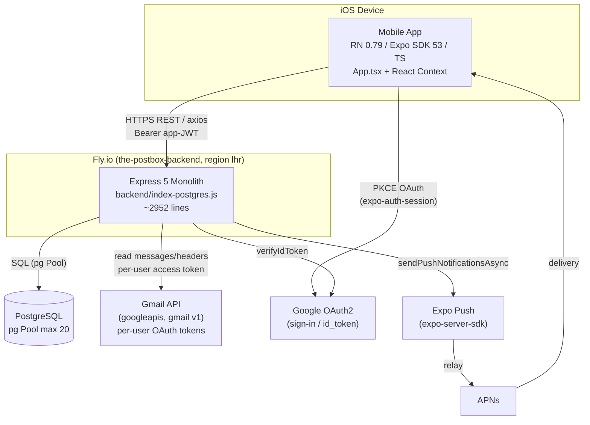
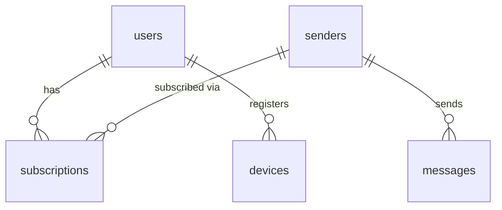

# The Postbox — System Architecture

> **Reflects the codebase as of 2026-06 (branch `fix/app-issues-post-cng`). Verify against code before relying on specifics.**

The Postbox is an iOS newsletter-reader app. This document describes the real, as-built architecture — including the places where the implementation diverges from older docs (README / IMPLEMENTATION_ROADMAP / CLAUDE.md). It is written engineer-to-engineer and is intended to be the canonical reference for how the system actually works today.

---

## Table of Contents

1. [Overview & Purpose](#1-overview--purpose)
2. [System Architecture](#2-system-architecture)
3. [Mobile Architecture](#3-mobile-architecture)
4. [Backend Architecture](#4-backend-architecture)
5. [Data Model](#5-data-model)
6. [Authentication Flow](#6-authentication-flow)
7. [Newsletter Ingestion Pipeline](#7-newsletter-ingestion-pipeline)
8. [Push Notifications](#8-push-notifications)
9. [Build & Deployment](#9-build--deployment)
10. [External Dependencies & Credentials](#10-external-dependencies--credentials)
11. [Cross-Platform / Android Readiness](#11-cross-platform--android-readiness)
12. [Scalability Considerations](#12-scalability-considerations)
13. [Monetization Readiness (Future)](#13-monetization-readiness-future)
14. [Known Gaps, Tech Debt & Doc Discrepancies](#14-known-gaps-tech-debt--doc-discrepancies)
15. [Maintaining this document](#maintaining-this-document)

---

## 1. Overview & Purpose

The Postbox lets a user connect their Gmail account, automatically discover the newsletters/bulk senders in their inbox, subscribe to the ones they want, and read those newsletters in a clean, app-native reading experience separate from email clutter.

The system has **three runtime components**:

| Component | Tech | Where it runs |
|-----------|------|---------------|
| **Mobile app** | React Native 0.79 / Expo SDK 53 / TypeScript (entry `mobile/index.js` → `mobile/App.tsx`) | User's iOS device |
| **Backend API** | Node.js / Express 5, single-file monolith `backend/index-postgres.js` (~2952 lines) | Fly.io app `the-postbox-backend`, region `lhr` |
| **PostgreSQL** | `pg` connection Pool (max 20) via `DATABASE_URL` | Managed Postgres |

External services the backend talks to: **Google OAuth2** (sign-in), **Gmail API** (`googleapis`, per-user read-only tokens), and **Expo Push** (`expo-server-sdk`, which relays to APNs). Sentry is wired into both mobile and backend for error reporting.

**Who this doc is for:** engineers maintaining or extending The Postbox — to understand component boundaries, the real ingestion/push mechanisms (which differ from earlier docs), and where the architectural ceilings are before scaling or monetizing.

---

## 2. System Architecture



**Prose.** The mobile app is the only client. It authenticates the user with Google via PKCE OAuth *on-device* (`expo-auth-session`), then exchanges the resulting Google `id_token` with the backend, which mints its own application JWTs. All subsequent mobile↔backend traffic is HTTPS REST over `axios` (base `https://the-postbox-backend.fly.dev`) carrying a Bearer app-JWT.

The backend is the sole holder of Gmail access. Using per-user Google OAuth tokens stored in Postgres, it reads message headers and bodies via `google.gmail('v1')`. It persists senders, subscriptions, and message bodies to PostgreSQL through a single `pg` Pool. When a genuinely new message is ingested, the backend pushes a notification through Expo Push, which relays to APNs.

Note that ingestion is **pull/poll-based and client-triggered** — there is no real-time Gmail push into the backend (see [§7](#7-newsletter-ingestion-pipeline)).

---

## 3. Mobile Architecture

Stack: **Expo SDK 53 / React Native 0.79 / TypeScript**. Entry point `mobile/index.js` → `mobile/App.tsx`. Navigation via `@react-navigation` v7.

### Navigation

A bottom-tab navigator (`MainTabs`) with 4 tabs, each owning its own native-stack:

| Tab | Label | Stack | Screens |
|-----|-------|-------|---------|
| `MailboxTab` | Mailbox | `InboxStack` | `Inbox` → `Detail` |
| `SubscriptionsTab` | **Sender** | (single) | `SenderManagement` |
| `SavedTab` | Saved | `SavedStack` | `Saved` → `Detail` |
| `SettingsTab` | Settings | `SettingsStack` | `Settings` → `ConnectedMailboxes` |

`ExploreTab` is commented out (`App.tsx` ~line 210). When there is no `authToken`, the app renders `LoginScreen` instead of the tabs.

### State — React Context only (no Redux)

Four providers are nested in `App.tsx` (~lines 300–310), in this order:

```
AuthProvider → SubscriptionProvider → GroupsProvider → MessagesProvider
```

| Context | Responsibility |
|---------|----------------|
| **AuthContext** | Token storage, `login` / `logout`, the axios refresh interceptor, and a 15-minute proactive health/refresh check. |
| **SubscriptionContext** | Holds pending subscribe/unsubscribe changes and flushes them to `POST /api/subscriptions/sync` on refresh. |
| **GroupsContext** | User-defined sender groups, persisted to `expo-secure-store` (key `user.groups.v1`); current selection is `All` / `Unread` / a specific group. |
| **MessagesContext** | In-memory `messages` array for the UI. |

### API client layer

`mobile/src/api/client.ts` exposes **two** axios instances:

- `apiClient` — 10s timeout, normal requests.
- `longTimeoutClient` — 60s timeout, used for slow operations like backfill.

The Bearer token is read from `expo-secure-store` (key `user_auth_token`). The base URL comes from `mobile/src/config/api.config.ts` (`EXPO_PUBLIC_API_URL`).

### Services

| Service | File | Notes |
|---------|------|-------|
| **Notifications** | `notifications.ts` | Expo notifications; `getExpoPushTokenAsync({ projectId: '28b83ffb-...' })` (line ~46); Android channels via `setupNotificationChannels` (line ~82); prefs in `AsyncStorage` key `notificationSettings`; quiet-hours support. |
| **Cache** | `cacheManager.ts` | Singleton. Caches newsletter HTML (gzip via `pako`) and images to `expo-file-system`; 100 MB cap, 30-day expiry, LRU eviction. |
| **Sentry** | `sentry.ts` | `@sentry/react-native`; enabled only when a DSN is set and `!__DEV__`. |

### Theming

`theme.ts` provides light/dark palettes; `navigation/navigationTheme.ts` themes React Navigation. Driven by `useColorScheme`, with `userInterfaceStyle: automatic` in app config.

---

## 4. Backend Architecture

The backend is a **single ~2952-line monolith**: `backend/index-postgres.js`. There is no module/router split — all routes, middleware, DB init, Gmail logic, and push logic live in this one file. `module.exports` exists at the bottom **for tests** (the `backend/__tests__` suite imports it), not for production composition.

### Middleware chain (in order)

1. **Sentry request handler** — conditional (only if a Sentry DSN is configured).
2. **`compression`** — gzip, level 6.
3. **`express.json`** — JSON body parsing.
4. **`logRequest`** — Pino-based; logs requests that are 4xx/5xx **or** slower than 1s.
5. **`authenticateToken`** (line ~590) — on protected routes; verifies the application JWT with `JWT_SECRET` and sets `req.user` (`{ userId, email }`).

### Routes grouped by domain

| Domain | Routes (method + path, with approximate line) |
|--------|-----------------------------------------------|
| **Auth** | `GET /auth` (1076), `GET /oauth2callback` (1085, legacy redirect to `newsletterreader://`), `POST /login` (1827, **primary mobile login**), `POST /auth/refresh` (1684, public), `POST /auth/refresh-gmail` (1610), `POST /auth/mobile-oauth` (1717), `POST /reauth` (2890) |
| **Messages** | `GET /api/messages` (1171), `GET /api/messages/:id` (2554), `POST /api/messages/:id/read` (2578), `.../unread` (2595), `POST /messages/clear` (2613) |
| **Senders / Subscriptions / Discovery** | `GET /api/senders` (1150), `GET /api/newsletters` (1205, public), `GET /discover` (1228), `POST /discover/subscribe` (1272), `POST /api/newsletters/subscribe` (1303), `.../unsubscribe` (1351), `GET /api/subscriptions` (1382), `POST /api/subscriptions/sync` (1419), `POST /subscriptions/toggle` (1575) |
| **Devices / Notifications** | `POST /devices` (2843, stores push token), `GET/POST /notification-settings[/sync]` (1499 / 1528 / 1554), `POST /api/test/notification` (950) |
| **Backfill / Rescan** | `POST /api/backfill` (2385), `GET /api/rescan` (1468), `GET /rescan` (2634), `POST /api/trigger-initial-scan` (2726), `.../trigger-initial-scan-manual` (2660) |
| **Debug / Health** | `GET /` , `GET /health` (661), `GET /health/detailed` (684), `GET /api/docs` (743), `GET /test` (817), `POST /api/test/add-sender` (826), `GET /api/debug/notifications` (870), `GET /debug/auth` (2806), `GET /api/user` (1134) |

There are several overlapping path variants (e.g. `/api/notification-settings` vs `/notification-settings`, `/api/rescan` vs `/rescan`). One of these variants is buggy — see [§14](#14-known-gaps-tech-debt--doc-discrepancies).

---

## 5. Data Model

Schema is created in `initializeDatabase` (`backend/index-postgres.js` ~lines 408–514), with indexes at ~509–514. Five tables.

### `users` (~line 409)

| Column | Notes |
|--------|-------|
| `id` | PK |
| `email` | UNIQUE |
| `google_id` | UNIQUE |
| `name`, `picture` | profile |
| `created_at`, `updated_at` | timestamps |
| `push_notifications_enabled` | BOOL |
| `google_refresh_token` | Google OAuth refresh token (often absent — see [§6](#6-authentication-flow)) |
| `temp_access_token` | current Google access token |
| `temp_token_expiry` | unix seconds |
| `initial_scan_complete` | BOOL — gates the first-login sender scan |

### `senders` (~line 427)

| Column | Notes |
|--------|-------|
| `id` | PK |
| `email` | NOT NULL |
| `name`, `picture` | display |
| `created_at`, `updated_at` | timestamps |

> **Schema drift:** `list_id` is referenced by `findOrCreateSender` (~line 2063), by the discoverable-newsletter seed, and by various queries, treating effective sender identity as `(email, list_id)` — but `list_id` is **not present in the `CREATE TABLE`**. See [§14](#14-known-gaps-tech-debt--doc-discrepancies).

### `subscriptions` (~line 439) — join table

| Column | Notes |
|--------|-------|
| `id` | PK |
| `user_id` | FK → `users` (ON DELETE CASCADE) |
| `sender_id` | FK → `senders` (ON DELETE CASCADE) |
| `is_active` | BOOL, default `true` |
| `created_at` | timestamp |

### `messages` (~line 450)

| Column | Notes |
|--------|-------|
| `id` | PK |
| `sender_id` | FK → `senders` (ON DELETE CASCADE) |
| `gmail_id` | TEXT, **UNIQUE NOT NULL** — dedup key |
| `subject` | |
| `body_html` | extracted HTML body |
| `received_at` | |
| `is_read`, `is_saved` | BOOL |
| `created_at` | timestamp |

> **Important:** `messages` are **not linked to a user directly.** A message belongs to a `sender`; a user sees a message only via an active row in `subscriptions` (i.e. `messages → senders → subscriptions → users`). All "my inbox" queries join through `subscriptions`.

### `devices` (~line 465)

| Column | Notes |
|--------|-------|
| `id` | PK |
| `user_id` | FK → `users` (ON DELETE CASCADE) |
| `fcm_token` | TEXT — **misnomer: actually stores Expo tokens** (`ExponentPushToken[...]`), not FCM tokens |
| `created_at` | timestamp |
| | UNIQUE `(user_id, fcm_token)` |

Discoverable newsletters are **not** a separate table — `seedDiscoverableNewsletters` (~line 160) seeds a curated list (with `list_id`) directly into `senders`.

### Relationship summary



---

## 6. Authentication Flow

Auth is **Google OAuth2 (PKCE) on-device + custom application JWTs minted by the backend**. **Firebase is NOT used for auth** — there are no calls to `admin.auth`, Firestore, or RTDB anywhere; the only Firebase usage is `admin.messaging()`, and even that is dead (see [§8](#8-push-notifications)).

### Step-by-step

1. **On-device PKCE.** `LoginScreen` uses `expo-auth-session/providers/google` `useAuthRequest`. Configured with the iOS client `493373719535-v990sc2u46lgga6nkbt962isqr7518ni`, the web client `...-68sbv92kmtnvujjclqja8bkt6kc0i8bs`, scope `gmail.readonly`, `access_type: offline`, `prompt: consent`, redirect `com.googleusercontent.apps.<iosClient>:/oauth2redirect`.
2. **Expo performs the PKCE code exchange internally**, returning an `id_token`, an `access_token`, and *possibly* a `refresh_token`.
3. **Mobile calls `POST /login`** with these tokens.
4. **Backend `/login` (line ~1827)** verifies the `id_token` via `oauth2Client.verifyIdToken` with audience `[web, ios]` (~line 1856). It extracts `sub`/`email` → `findOrCreateUser`, stores the Google `access_token` in `users.temp_access_token` (1h) and, **if present**, the `refresh_token` in `users.google_refresh_token`. If `initial_scan_complete` is false, it kicks off `initialSenderScan` asynchronously.
5. **Backend issues TWO application JWTs** (~line 2022):
   - **Access JWT** — payload `{ userId, email }`, signed with `JWT_SECRET`, **1h** lifetime.
   - **Refresh JWT** — payload `{ userId, type: 'refresh' }`, signed with `REFRESH_JWT_SECRET`, **90d** lifetime.
   - Returns `{ token, refreshToken, expiresIn: 3600 }`.
6. **Mobile stores both** in `expo-secure-store` (`user_auth_token`, `user_refresh_token`).

### Refresh — two distinct refresh paths (and their fragility)

There are **two independent refresh mechanisms**, which is a source of fragility:

- **App-JWT refresh.** The `AuthContext` axios **response interceptor** (~line 251) catches `401`/`403`, calls `POST /auth/refresh` (public, ~line 1684, verifies `REFRESH_JWT_SECRET`) and receives a fresh 1h access token. A request queue prevents refresh storms; a 15-minute `setInterval` proactively refreshes when <30 min to expiry (~line 376); a recovery dialog offers retry/logout.
- **Gmail-token refresh.** Separately, `POST /auth/refresh-gmail` (~line 1610) refreshes the *Google* access token from `users.google_refresh_token`, needed so backfill can call the Gmail API.

> **Fragility.** Mobile PKCE frequently returns **no Google `refresh_token`**. When that happens, the Google access token in `temp_access_token` silently expires and there is no stored `google_refresh_token` to renew it — so Gmail access dies and the user is forced to re-login. This surfaces as `needsReauth` / 401s during `triggerBackfill`. The two refresh paths (app-JWT vs Gmail-token) being decoupled means a healthy app-JWT can coexist with dead Gmail access.

---

## 7. Newsletter Ingestion Pipeline

> **Be honest about this:** ingestion is **poll / pull-based and client-triggered. It is NOT real-time.** There is **no** `gmail.users.watch()`, **no** Pub/Sub topic, subscription, or webhook anywhere. `@google-cloud/pubsub` is imported (`backend/index-postgres.js` line 22) but **never used** — it is dead weight.

There are **three real ingestion paths**, all of which run server-side but are kicked off by the client:

### 1. Initial sender scan (first login)

`initialSenderScan` (~line 2310), fired asynchronously from `/login` (~line 1954) the first time a user logs in (when `initial_scan_complete` is false). It lists up to ~300 recent Gmail messages, reads the `From` and `List-Unsubscribe` headers, registers the bulk/list senders it finds, and sets `users.initial_scan_complete = true`.

### 2. Backfill (pull-to-refresh)

`POST /api/backfill` (~line 2385). Builds a Gmail search query (`from:(a) OR from:(b) ...`) over the user's **active** subscriptions, bounded `after:<~7 days ago>`, fetches the full matching messages, extracts HTML, and calls `saveMessage`. Triggered from mobile pull-to-refresh: `InboxScreen.onRefresh` (~line 697) calls backfill, then reloads `/api/messages` after ~3s.

### 3. Rescan

A family of manual re-scan endpoints: `GET /api/rescan` (1468), `GET /rescan` (2634), `POST /api/trigger-initial-scan` (2726), and `.../trigger-initial-scan-manual` (2660).

### `saveMessage` and dedup

`saveMessage` (~line 2265) inserts with `ON CONFLICT (gmail_id) DO NOTHING`, so re-ingesting the same Gmail message is a no-op. **Only when a genuinely new row is inserted** does it call `sendNotificationForNewMessage` (~line 2291). Consequently, **push notifications only fire during a client-initiated backfill/scan** — there is no server-side process that discovers mail on its own.

---

## 8. Push Notifications

> **Be honest about this:** the live push mechanism is **Expo Push**. The Firebase Admin `admin.messaging()` branch is **dead code** for all current tokens, and `firebase-admin` is **vestigial**.

### Registration

Mobile obtains an Expo push token via `getExpoPushTokenAsync({ projectId: '28b83ffb-...' })` (`notifications.ts` ~line 46) and registers it with `POST /devices`, which stores it in `devices.fcm_token` (the column name is a misnomer — it holds `ExponentPushToken[...]` strings).

### Send path

`sendNotificationForNewMessage` (~line 2106):

1. Find users subscribed to the message's sender who have `push_notifications_enabled`.
2. Gather their device tokens.
3. Per-token branch (~line 2180):
   - If the token `startsWith('ExponentPushToken[')` → `expo.sendPushNotificationsAsync` (**LIVE** — this is the path every current token takes).
   - Else → `admin.messaging().send` (**DEAD** — no client ever produces a raw FCM token, so this branch is never exercised).
4. Logs a tally `Expo=x Firebase=y` (~line 2253).

### Firebase init (vestigial)

Firebase is initialized at ~lines 121–140: it loads a service account from `FIREBASE_SERVICE_ACCOUNT_KEY` env or `./serviceAccountKey.json`, and calls `admin.initializeApp` only if a key is present and not running under test. Since only `admin.messaging()` is referenced and the FCM branch is unreachable, **`firebase-admin` can be considered vestigial** and is a candidate for removal.

> Push only fires as a side effect of a **client-triggered backfill/scan** that inserts a new message (see [§7](#7-newsletter-ingestion-pipeline)). There is no background delivery.

---

## 9. Build & Deployment

### Mobile — CNG / managed prebuild (NOT bare)

The mobile app uses Expo **Continuous Native Generation (managed prebuild)** — it is **not** a bare workflow.

- **`mobile/app.config.js` is the authoritative native configuration.**
- `mobile/ios/` and `mobile/android/` are **untracked and git-ignored** (`git ls-files` returns 0 tracked files for both). `.easignore` lists `ios/`, `android/`, `node_modules/`, `.expo/`, `.env`, and tests. With native dirs untracked, EAS detects the project as **managed** and runs `expo prebuild` to regenerate them at build time.
- **Plugins** (`app.config.js` ~line 58): `expo-build-properties` (iOS `deploymentTarget` 15.6, `newArchEnabled: false`), `expo-notifications`, `expo-secure-store`, `expo-font`.
- **Bundle id** `io.thepostbox.app` for **all variants** (~line 20). URL **scheme** `postbox` (prod) / `postbox-dev` (dev). The Google reversed-client-id URL scheme is injected via `CFBundleURLTypes` (~line 51). `ITSAppUsesNonExemptEncryption: false`; ATS configured HTTPS-only plus local networking.

**EAS profiles** (`mobile/eas.json`):

| Profile | Purpose |
|---------|---------|
| `development` | dev client, internal distribution |
| `preview` | internal distribution, Sentry DSN |
| `production` | store distribution, `autoIncrement`, Sentry DSN |

All profiles set `EXPO_PUBLIC_API_URL = https://the-postbox-backend.fly.dev`. `appVersionSource: remote`. Submit config: Apple ID `siddharth.daswani7@gmail.com`, team `JK23LR6DZS`. EAS `projectId` `28b83ffb-dfc8-40e9-955a-b011fe8d8aee`. `eas-build-pre-install` sets `legacy-peer-deps true`.

### Backend — Fly.io

- **`backend/Dockerfile`:** `node:20-slim`, `npm install --omit=dev`, `CMD node index-postgres.js`.
- **`backend/fly.toml`:** app `the-postbox-backend`, region `lhr`, internal port `3000`, `force_https`, auto-stop/auto-start machines with **`min_machines_running = 0`** (scale-to-zero → cold starts), 1 shared CPU / 1 GB RAM, `NODE_ENV=production`.
- **Env/secrets.** Backend reads the root `.env`: `DATABASE_URL`, `JWT_SECRET`, `REFRESH_JWT_SECRET`, `GOOGLE_CLIENT_ID`, `GOOGLE_CLIENT_SECRET`, `PRODUCTION_REDIRECT_URI`, `PORT`, `NODE_ENV`. `SENTRY_DSN` and `FIREBASE_SERVICE_ACCOUNT_KEY` are read by the code but are **not** in local `.env` — they are supplied as **Fly secrets**. `serviceAccountKey.json` and `.env` are git-ignored.

---

## 10. External Dependencies & Credentials

| Service | What / Where |
|---------|--------------|
| **Google OAuth2** | iOS client `493373719535-v990sc2u46lgga6nkbt962isqr7518ni`; Web client `...-68sbv92kmtnvujjclqja8bkt6kc0i8bs`. Hardcoded in `LoginScreen`, used as backend `verifyIdToken` audience, and referenced in `app.config.js` (reversed-client-id scheme). Backend additionally uses `GOOGLE_CLIENT_ID` / `GOOGLE_CLIENT_SECRET` env vars. |
| **Gmail API** | Scope `gmail.readonly`; per-user OAuth tokens stored in the `users` table (`temp_access_token`, `google_refresh_token`). **No Pub/Sub credential** (none needed — ingestion is poll-based). |
| **Expo Push** | Real relay to APNs. Expo `projectId` `28b83ffb-dfc8-40e9-955a-b011fe8d8aee`; tokens via `getExpoPushTokenAsync`. |
| **Sentry** | **Two projects** under org `sid-design`: `react-native` (mobile) and `the-postbox-backend` (backend). Mobile DSN lives in `eas.json` (`...4511480109072464`); backend DSN via `SENTRY_DSN` (Fly secret). |
| **Fly secrets** | `DATABASE_URL`, JWT secrets, Google client secret, `SENTRY_DSN`, Firebase service account. |
| **Firebase SA** (vestigial) | `serviceAccountKey.json` / `FIREBASE_SERVICE_ACCOUNT_KEY`, project `newsletter-reader-app`. Only `admin.messaging()` is touched and that path is dead — see [§8](#8-push-notifications). |

---

## 11. Cross-Platform / Android Readiness

Because the app is React Native / Expo, it is **portable in principle** — but it is iOS-only in practice today. The owner **wants Android in the future**; here are the concrete gaps:

- **No `androidClientId`.** `LoginScreen` configures only `iosClientId` + `webClientId`. The redirect / `CFBundleURLTypes` handling is iOS-specific.
- **No `android:` block in `app.config.js`.** There is only an `ios:` block — no Android `package`, `intentFilters`, or `googleServicesFile`.
- **Android push needs real FCM.** Android delivery would require a genuine FCM setup + `google-services.json` + EAS FCM credentials. Today only the Expo → APNs path works; the FCM branch in the backend is dead/untested. (`setupNotificationChannels`, `notifications.ts` ~line 82, does create Android notification channels, so the client is *partly* ready.)
- **No Android EAS/submit config.** `expo-build-properties` only sets the iOS `deploymentTarget`; EAS profiles only specify `ios.resourceClass`; there is no Android build or submit configuration; submit is Apple-only.

---

## 12. Scalability Considerations

Framed as the **current ceiling** and **where to invest when scaling**:

| Area | Current state | Where to invest |
|------|---------------|-----------------|
| **Monolith** | A single ~99 KB / ~2952-line file (`index-postgres.js`) holds everything. | Split into routers/services as the team grows; it's a maintainability ceiling more than a runtime one. |
| **Ingestion** | Poll, not push. Newsletters only arrive on pull-to-refresh → `/api/backfill` runs a Gmail search per active sender plus full fetches. | Move to Gmail `watch()` + Pub/Sub for true real-time, or a scheduled background poller. |
| **N+1 Gmail calls** | `messages.get` per message (≈300 on initial scan, ≈100 on backfill, serialized in small batches). | Batch requests, parallelize, cache message IDs. |
| **Per-user Gmail token model** | Brittle — PKCE often yields no refresh token → forced re-auth (see [§6](#6-authentication-flow)). | Ensure offline refresh tokens are reliably obtained/stored; consider a server-side OAuth code exchange. |
| **Fly scale-to-zero** | `min_machines_running = 0` → cold starts on login/refresh. | Raise min machines (or warm-keep) once traffic justifies it. |
| **PostgreSQL** | Single `pg` Pool, max 20, ~2s connect timeout. | Tune pool size, add read replicas / pgbouncer as load grows. |
| **Expo Push** | Single external relay dependency with its own rate limits. | Add retry/backoff; consider direct APNs/FCM at scale. |
| **No job queue** | Notification send is **inline** in `saveMessage` — no retry, no batching. | Introduce a job queue/worker for ingestion and push. |
| **Logging** | Heavy/verbose logging. | Sample/trim in production. |

---

## 13. Monetization Readiness (Future)

The owner is **considering** an AI-feature subscription and/or ads. **Stated plainly: no monetization architecture exists today.** A grep of the codebase confirms the **absence** of `react-native-iap`, `expo-in-app-purchases`, RevenueCat, Stripe, AdMob / `google-mobile-ads`, and any `paywall` / `billing` / `entitlement` / `tier` constructs. The `users` table has no `is_premium`, `tier`, `subscription_status`, or `entitlement` column. There is **no AI surface** — no LLM calls or summarization endpoints anywhere.

**What would need adding** (considerations, not a committed design):

- An **entitlement / tier field on `users`** (e.g. `tier`, `entitlement`, `subscription_status`).
- **Gating middleware** in the backend to enforce entitlements per route/feature.
- **IAP integration** (`react-native-iap` or `expo-in-app-purchases`) plus **server-side receipt validation** (Apple, later Google Play).
- An **optional ad SDK** (e.g. `google-mobile-ads`) if pursuing ads.
- An **AI endpoint surface** (summarization/chat) to be the paid feature, with its own provider credentials and cost controls.

These are directional only; nothing here is implemented or designed yet.

---

## 14. Known Gaps, Tech Debt & Doc Discrepancies

| # | Issue | Reality | Reference |
|---|-------|---------|-----------|
| 1 | **Pub/Sub "real-time" pipeline** claimed in docs | Does **not** exist. `@google-cloud/pubsub` imported but never used; ingestion is poll-based. | README L7/41/47; ROADMAP L35; CLAUDE L39–49/206/373–374; code line 22 |
| 2 | **`GET /notification-settings`** selects non-existent columns | Selects `email_notifications`, `push_notifications`, `digest_frequency`, `quiet_hours_start`, `quiet_hours_end` — none exist (only `push_notifications_enabled`) → **throws / 500 at runtime**. The `GET /api/notification-settings` variant is correct. **This is actively hit, not latent**: the mobile app calls the broken route (`mobile/src/api/client.ts:349`). | line ~1528 (bad) vs line ~1499 (correct) |
| 3 | **`senders.list_id` schema drift** | Used by `findOrCreateSender`/seed/queries (effective identity `(email, list_id)`) but **absent from the `CREATE TABLE`**. | `findOrCreateSender` ~line 2063 vs `senders` DDL ~line 427 |
| 4 | **Stale Railway redirect URI** | Backend default prod redirect is `https://the-postbox-production.up.railway.app/oauth2callback` — but deployment is **Fly.io**. Dead reference. | line ~1059 |
| 5 | **`/oauth2callback` redirects to dead scheme** | Redirects to `newsletterreader://`, which doesn't match the app's `postbox` / `postbox-dev` schemes. Legacy/dead path. | line ~1125 |
| 6 | **Push-via-Firebase** claimed in docs | Expo Push is live; `admin.messaging()` branch is dead; `firebase-admin` vestigial. | README L299; CLAUDE L39; ROADMAP L87; code ~line 2180 |
| 7 | **`devices.fcm_token` misnomer** | Column named `fcm_token` but actually stores Expo `ExponentPushToken[...]`. | `devices` DDL ~line 465 |
| 8 | **"Queue push job"** claimed in ROADMAP | No queue — push send is synchronous/inline in `saveMessage`. | ROADMAP L88; code ~line 2265/2291 |
| 9 | **CLAUDE "Pub/Sub ping privacy"** note | Moot — no Pub/Sub exists. | CLAUDE L374 |
| 10 | **No E2E push verification** | The end-to-end push path has not been verified in a real device test. | — |

---

## Maintaining this document

`ARCHITECTURE.md` is the **canonical system reference** for The Postbox. Update it whenever the architecture changes — new components, schema changes, a real ingestion/push redesign, monetization work, or Android support. Keep the division of labor clear:

- **`ARCHITECTURE.md`** (this file) — how the system is built and why; the canonical map.
- **`CLAUDE.md`** — agent-facing gotchas and operational notes.
- **`README.md`** — project log / setup / running notes.

When the implementation and this document disagree, treat the **code** as truth, fix the code or the doc, and record the resolution here.
