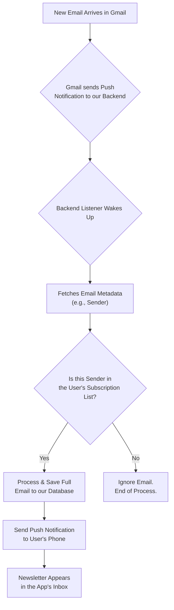
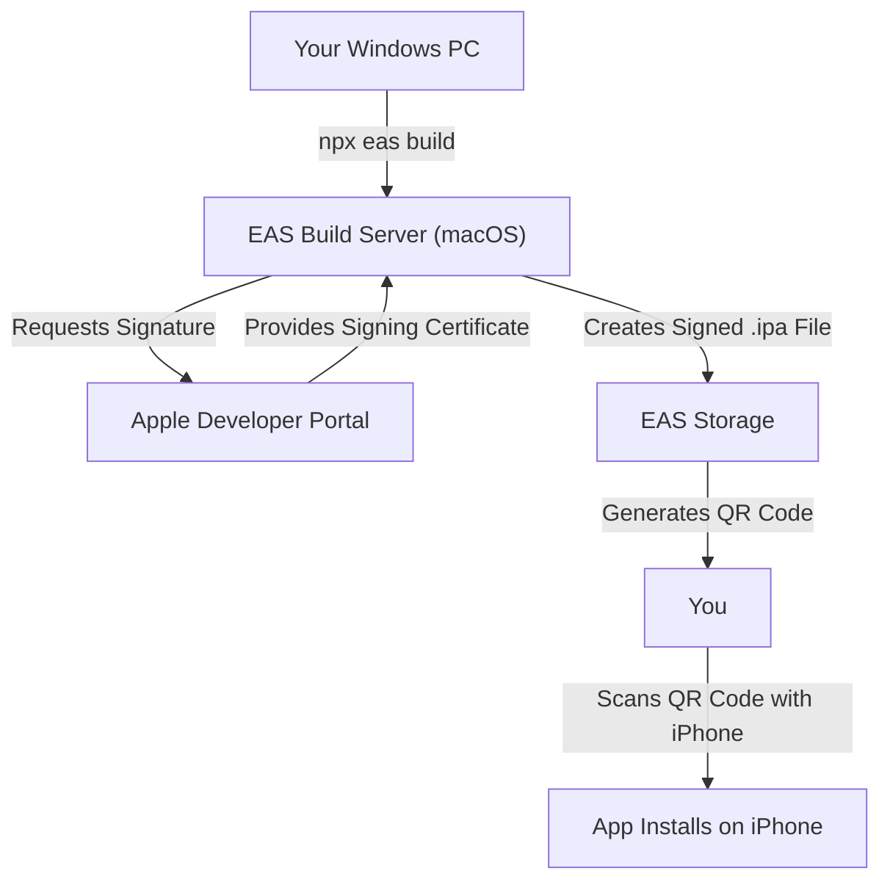

# 📬 Newsletter Reader

This project is a mobile application designed to provide a clean, focused reading experience for email newsletters. It consists of a backend service to process incoming emails and a React Native mobile app.

## Technology Stack & Strategy

- **Backend:** Node.js with Express, connecting to a PostgreSQL database. It uses the Gmail API and Pub/Sub for real-time email processing.
- **Backend Testing:** The backend API is tested using Jest and Supertest to ensure all endpoints are reliable and secure.
- **Mobile App:** Built with React Native (Bare Workflow).
- **Development Strategy:** The project follows an **iOS-first** development strategy. Builds for the iOS platform are created using **Expo Application Services (EAS) Build**, which allows for building and deploying to physical devices from a non-macOS development environment.

## Design and Theming

The application uses a consistent color palette across both light and dark modes to ensure a clean and readable user interface. The color scheme is defined in `mobile/src/theme.ts`.

### Color Palette

| Role | Light Mode | Dark Mode |
| :--- | :--- | :--- |
| **Primary** | `Royal Blue` (`#4A90E2`) | `Royal Blue` (`#4A90E2`) |
| **Background** | `Light Gray` (`#F4F6F8`) | `Dark Charcoal` (`#1A202C`) |
| **Surface** | `White` (`#FFFFFF`) | `Dark Gray` (`#2D3748`) |
| **Text (Primary)** | `Charcoal` (`#1A202C`) | `Off-White` (`#E2E8F0`) |
| **Text (Secondary)**| `Slate Gray` (`#718096`) | `Light Slate` (`#A0AEC0`) |

## Testing Strategy

The mobile app uses a combination of tools to ensure code quality and stability:

- **Unit & Component Testing:** [Jest](https://jestjs.io/) is used as the primary test runner. We use [React Native Testing Library](https://testing-library.com/docs/react-native-testing-library/intro) to write tests that interact with components in a way that closely resembles a real user's experience.
- **Integration Testing:** For end-to-end user flows, we've built integration tests that simulate the full navigation journey (e.g., Login → Inbox → Detail). These tests verify that all parts of the application—authentication, API calls, and navigation—work together correctly.
- **Test Identification:** To create robust and maintainable tests, we add `testID` props to key components, allowing us to select them without relying on fragile implementation details.
- **Dependency Management:** The testing environment has known dependency conflicts with `react-test-renderer`. These have been resolved by forcing the installation of version `18.2.0` to match the project's React version.
- **Workflow:** All new features or bug fixes must be accompanied by corresponding tests. The full test suite must pass before any code is committed.

## Branding and UX

### App Name

The official name for the application is **The Postbox**.

A list of alternative names has been documented for future consideration:
- **Direct & Clear:** Readbox, Letterhead, Cleanfeed
- **Modern & Abstract:** Unfold, Capsule, Relay
- **Friendly & Familiar:** Paperboy, Scroll

### Language and Tone

The application's voice is guided by three principles:
- **Clear:** We use simple, direct language and avoid technical jargon.
- **Calm:** The user experience should be a relief from a chaotic inbox. The language is reassuring and serene.
- **Respectful:** We are transparent about data handling and always put the user's privacy and control first.

## Core Logic: Email Processing Flow

The application uses an event-driven flow to efficiently process incoming emails without constantly scanning the user's inbox. This ensures privacy, performance, and real-time updates.

### Flow Breakdown

1.  **Watch Setup:** On initial authentication, the app asks Google to send a notification to our backend whenever a new email arrives.
2.  **Notification (Ping):** When a new email is received, Google "pings" our backend. This ping contains no private content.
3.  **Sender Verification:** The backend fetches only the email's sender and checks it against a database of senders the user has explicitly approved.
4.  **Process or Ignore:** If the sender is on the user's approved list, the backend fetches the full email, processes it, and saves it. Otherwise, the email is completely ignored.
5.  **Push to App:** If an email is processed, a notification is sent to the user's device, and the newsletter appears in the app.

## Project Log

### Session 1: Foundation & MVP Scaffolding

This session focused on establishing the core architecture, user flow, and feature set for the MVP.

#### Key Decisions & Strategy:

*   **Application Name:** The official name was chosen as **The Postbox**.
*   **Brand Voice:** The app's language will be **Clear, Calm, and Respectful**.
*   **Core Logic:** We pivoted from a fragile Gmail label-based system to a robust backend approach that identifies newsletters by checking for the `List-Unsubscribe` header. This is less invasive and more reliable.
*   **User Control:** The user will have full control over their subscriptions. The app will perform a one-time scan on first login to suggest senders, which the user can then manage from a dedicated screen.
*   **Monorepo Structure:** We affirmed the project structure, with the `backend` and `mobile` apps as two separate, independent projects within the same repository, each with its own `package.json`.
*   **Development Workflow:** We established a strict development process: **Implement ➔ Test ➔ Document ➔ Commit**.

#### Implementation Highlights:

*   **Backend:**
    *   The database schema was finalized with `users` and `subscriptions` tables.
    *   A full JWT authentication system was implemented to secure all API endpoints.
    *   The "magic onboarding" feature to scan for and save a new user's initial subscriptions was built.
    *   The complete set of MVP API endpoints (`/messages`, `/senders`, `/subscriptions/toggle`) was created.
*   **Mobile App:**
    *   The app was fully connected to the backend, replacing all mock data.
    *   An authentication context using `expo-secure-store` was created to manage the user's session and JWT.
    *   The `SenderManagementScreen` was built and connected to the live API.
*   **Testing:**
    *   A comprehensive test suite was written for all new functionality.
    *   A robust mocking strategy for the `apiClient` was implemented, allowing for stable and reliable component testing.

### Session 2: iOS Build Configuration

This session focused on preparing the project for its first iOS development build using Expo Application Services (EAS).

#### Key Decisions & Strategy:

*   **Bundle Identifier:** The official iOS bundle identifier was set to `com.postbox.app`.
*   **Apple Developer Account:** The project was linked to the registered Apple Developer account by adding the unique Team ID to the Expo configuration (`app.json`). This step unblocked the ability to perform a development build and deploy the app to a physical device for testing.

#### Implementation Highlights:

*   **Configuration:**
    *   Updated `mobile/app.json` with the new `bundleIdentifier` and `appleTeamId`.
    *   Updated the app `name` to "The Postbox" to align with branding.

## Push Notifications

To keep users informed about new newsletter issues, a complete push notification system has been implemented. The goal is to deliver timely, relevant alerts without being intrusive.

### Notification Flow

1.  **Client Registration**: Upon login, the mobile app requests permission from the user to send notifications.
2.  **Token Generation**: If permission is granted, the app uses `expo-notifications` to request a unique Expo Push Token from Apple (APNs) or Google (FCM).
3.  **Backend Storage**: This token is sent to the backend via a `POST /devices` request and stored securely, associated with the user.
4.  **Trigger Event**: When the backend Gmail synchronization job processes a new email and identifies it as a subscribed newsletter, it triggers a push notification event.
5.  **Message Delivery**: The backend uses the Firebase Admin SDK to send a notification to the user's registered devices via the stored token.
6.  **Client Handling**: The mobile app receives the notification. If the app is in the foreground, it displays an alert. If in the background, the OS handles the display.

This architecture ensures a decoupled and robust system. The mobile client is only responsible for registering itself and handling the final payload, while the backend manages the complex logic of when and what to send. We use Expo's notification services to abstract away the complexities of dealing directly with APNs and FCM.

## Authentication and Security

The application uses a JSON Web Token (JWT) based authentication strategy to secure the backend API and ensure that users can only access their own data.

### Authentication Flow

1.  **Google Sign-In**: The user initiates the login process on the mobile app using Google Sign-In, which is handled by `expo-auth-session`. This provides a secure, standard-based way for the user to authenticate.
2.  **Token Exchange**: After a successful Google login, the client receives a Google ID Token. It sends this token to the backend's public `/login` endpoint.
3.  **JWT Issuance**: The backend verifies the Google ID Token (or, in the current implementation, uses the provided Google ID and email to find or create a user) and generates a custom, short-lived JWT for our application.
4.  **Secure Storage**: The mobile client receives this JWT and stores it securely on the device using `expo-secure-store`.
5.  **Authenticated Requests**: For all subsequent requests to protected API endpoints, the JWT is automatically included in the `Authorization: Bearer <token>` header. This is managed centrally in the `AuthContext`.
6.  **Backend Verification**: A middleware on the backend intercepts every request to a protected route, verifies the JWT's signature and expiration, and grants access if the token is valid.

This approach ensures that the user's Google credentials are never stored or handled directly by our backend. All access is controlled through our own application-specific tokens.

### Jest Configuration Challenges

During development, significant challenges were encountered while configuring the Jest testing environment for the React Native (Expo) project. These issues primarily stemmed from the interaction between Jest's Node.js environment and the native modules and modern JavaScript syntax (ES Modules) used by Expo and related libraries.

The following errors were encountered and addressed:

*   **`SyntaxError: Unexpected token 'export'`**: Caused by libraries (`@react-navigation`, `expo-*`, etc.) shipping untranspiled ES Module syntax.
    *   **Solution**: A comprehensive `transformIgnorePatterns` regex was added to `jest.config.js` to instruct Babel to transpile these specific modules.
*   **`TypeError: Cannot read properties of undefined (reading 'NativeModule')`**: This occurred when tests tried to import libraries with deep native dependencies that don't exist in a Node.js environment (`expo-device`, `expo-secure-store`, `expo-web-browser`, `expo-auth-session`).
    *   **Solution**: These libraries were explicitly mocked in a central Jest setup file (`__tests__/jest/setup.js`) to provide a fake, functional implementation for the test runner.
*   **Test Timeouts and Logic Errors**: Initial tests were timing out or failing because they were making real API calls or because the test assertions did not match the component's actual output.
    *   **Solution**: A conventional mocking strategy for our `apiClient` was implemented. This, combined with correcting bugs found in the component source code, allowed the tests to run against predictable data.

This experience highlights the importance of a robust and precise testing configuration from the outset of a React Native project.

## MVP Build & Device Testing

To test the application on a physical iPhone, we use **Expo Application Services (EAS) Build**. This is a cloud service that compiles and signs our app, allowing us to build for iOS from a non-macOS development environment.

### Testing Workflow

1.  **Authentication**: The first time, we will connect the project to your Expo and Apple Developer accounts.
2.  **Trigger Build**: We will run `npx eas build --profile development --platform ios`. This uploads the code to EAS and starts the build process on a cloud-based macOS server.
3.  **Code Signing**: EAS uses your Apple Developer credentials to request a signing certificate from Apple. This certificate is mandatory for any app that runs on a physical iPhone.
4.  **Installation**: Once the build is complete, EAS provides a QR code. Scanning this code with your iPhone will install a "custom development client"—our app, with development tools included.
5.  **Live Development**: With the app installed on your phone, we will run `npm start` on your PC. The app on your phone will connect to this local server, allowing you to see code changes live on your device as they are made.

### Visual Flow

## Getting Started

For detailed instructions on setting up the backend or mobile components, please see the `README.md` file within the respective `backend/` and `mobile/` directories. 