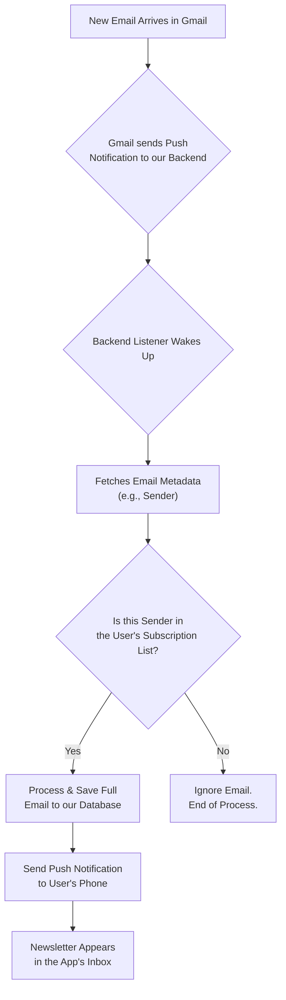

# 📬 Newsletter Reader

This project is a mobile application designed to provide a clean, focused reading experience for email newsletters. It consists of a backend service to process incoming emails and a React Native mobile app.

## Technology Stack & Strategy

- **Backend:** Node.js with Express, connecting to a PostgreSQL database. It uses the Gmail API and Pub/Sub for real-time email processing.
- **Mobile App:** Built with React Native (Bare Workflow).
- **Development Strategy:** The project follows an **iOS-first** development strategy. Builds for the iOS platform are created using **Expo Application Services (EAS) Build**, which allows for building and deploying to physical devices from a non-macOS development environment.

## Design and Theming

The application uses a consistent color palette across both light and dark modes to ensure a clean and readable user interface. The color scheme is defined in `mobile/src/theme.ts`.

### Color Palette

| Role | Light Mode | Dark Mode |
| :--- | :--- | :--- |
| **Primary** | `Royal Blue` (`#4A90E2`) | `Royal Blue` (`#4A90E2`) |
| **Background** | `Light Gray` (`#F4F6F8`) | `Dark Charcoal` (`#1A202C`) |
| **Surface** | `White` (`#FFFFFF`) | `Dark Gray` (`#2D3748`) |
| **Text (Primary)** | `Charcoal` (`#1A202C`) | `Off-White` (`#E2E8F0`) |
| **Text (Secondary)**| `Slate Gray` (`#718096`) | `Light Slate` (`#A0AEC0`) |

## Testing Strategy

The mobile app uses a combination of tools to ensure code quality and stability:

- **Unit & Component Testing:** [Jest](https://jestjs.io/) is used as the primary test runner. We use [React Native Testing Library](https://testing-library.com/docs/react-native-testing-library/intro) to write tests that interact with components in a way that closely resembles a real user's experience.
- **Test Identification:** To create robust and maintainable tests, we add `testID` props to key components, allowing us to select them without relying on fragile implementation details.
- **Dependency Management:** The testing environment has known dependency conflicts with `react-test-renderer`. These have been resolved by forcing the installation of version `18.2.0` to match the project's React version.
- **Workflow:** All new features or bug fixes must be accompanied by corresponding tests. The full test suite must pass before any code is committed.

## Core Logic: Email Processing Flow

The application uses an event-driven flow to efficiently process incoming emails without constantly scanning the user's inbox. This ensures privacy, performance, and real-time updates.

### Flow Breakdown

1.  **Watch Setup:** On initial authentication, the app asks Google to send a notification to our backend whenever a new email arrives.
2.  **Notification (Ping):** When a new email is received, Google "pings" our backend. This ping contains no private content.
3.  **Sender Verification:** The backend fetches only the email's sender and checks it against a database of senders the user has explicitly approved.
4.  **Process or Ignore:** If the sender is on the user's approved list, the backend fetches the full email, processes it, and saves it. Otherwise, the email is completely ignored.
5.  **Push to App:** If an email is processed, a notification is sent to the user's device, and the newsletter appears in the app.

## Getting Started

For detailed instructions on setting up the backend or mobile components, please see the `README.md` file within the respective `backend/` and `mobile/` directories. 