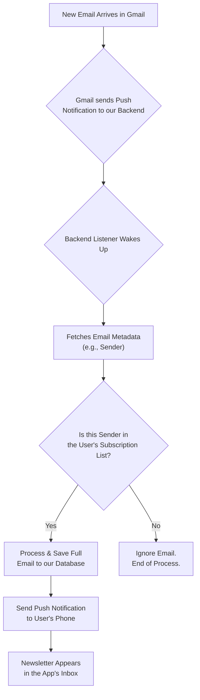
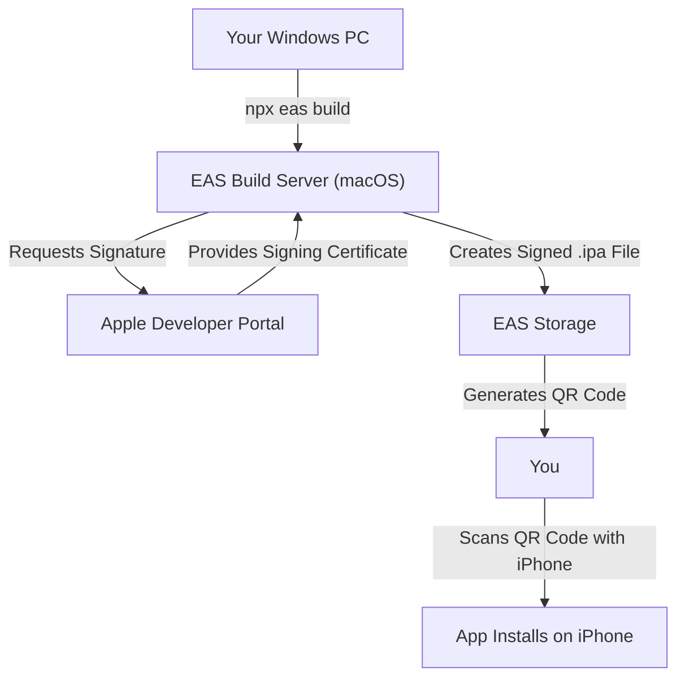

# 📬 Newsletter Reader

This project is a mobile application designed to provide a clean, focused reading experience for email newsletters. It consists of a backend service to process incoming emails and a React Native mobile app.

## Technology Stack & Strategy

- **Backend:** Node.js with Express, connecting to a PostgreSQL database. It uses the Gmail API and Pub/Sub for real-time email processing.
- **Backend Testing:** The backend API is tested using Jest and Supertest to ensure all endpoints are reliable and secure.
- **Mobile App:** Built with React Native (Bare Workflow).
- **Development Strategy:** The project follows an **iOS-first** development strategy. Builds for the iOS platform are created using **Expo Application Services (EAS) Build**, which allows for building and deploying to physical devices from a non-macOS development environment.

## Design and Theming

The application uses a consistent color palette across both light and dark modes to ensure a clean and readable user interface. The color scheme is defined in `mobile/src/theme.ts`.

### Color Palette

| Role | Light Mode | Dark Mode |
| :--- | :--- | :--- |
| **Primary** | `Royal Blue` (`#4A90E2`) | `Royal Blue` (`#4A90E2`) |
| **Background** | `Light Gray` (`#F4F6F8`) | `Dark Charcoal` (`#1A202C`) |
| **Surface** | `White` (`#FFFFFF`) | `Dark Gray` (`#2D3748`) |
| **Text (Primary)** | `Charcoal` (`#1A202C`) | `Off-White` (`#E2E8F0`) |
| **Text (Secondary)**| `Slate Gray` (`#718096`) | `Light Slate` (`#A0AEC0`) |

## Testing Strategy

The mobile app uses a combination of tools to ensure code quality and stability:

- **Unit & Component Testing:** [Jest](https://jestjs.io/) is used as the primary test runner. We use [React Native Testing Library](https://testing-library.com/docs/react-native-testing-library/intro) to write tests that interact with components in a way that closely resembles a real user's experience.
- **Integration Testing:** For end-to-end user flows, we've built integration tests that simulate the full navigation journey (e.g., Login → Inbox → Detail). These tests verify that all parts of the application—authentication, API calls, and navigation—work together correctly.
- **Test Identification:** To create robust and maintainable tests, we add `testID` props to key components, allowing us to select them without relying on fragile implementation details.
- **Dependency Management:** The testing environment has known dependency conflicts with `react-test-renderer`. These have been resolved by forcing the installation of version `18.2.0` to match the project's React version.
- **Workflow:** All new features or bug fixes must be accompanied by corresponding tests. The full test suite must pass before any code is committed.

## Branding and UX

### App Name

The official name for the application is **The Postbox**.

A list of alternative names has been documented for future consideration:
- **Direct & Clear:** Readbox, Letterhead, Cleanfeed
- **Modern & Abstract:** Unfold, Capsule, Relay
- **Friendly & Familiar:** Paperboy, Scroll

### Language and Tone

The application's voice is guided by three principles:
- **Clear:** We use simple, direct language and avoid technical jargon.
- **Calm:** The user experience should be a relief from a chaotic inbox. The language is reassuring and serene.
- **Respectful:** We are transparent about data handling and always put the user's privacy and control first.

## Core Logic: Email Processing Flow

The application uses an event-driven flow to efficiently process incoming emails without constantly scanning the user's inbox. This ensures privacy, performance, and real-time updates.

### Flow Breakdown

1.  **Watch Setup:** On initial authentication, the app asks Google to send a notification to our backend whenever a new email arrives.
2.  **Notification (Ping):** When a new email is received, Google "pings" our backend. This ping contains no private content.
3.  **Sender Verification:** The backend fetches only the email's sender and checks it against a database of senders the user has explicitly approved.
4.  **Process or Ignore:** If the sender is on the user's approved list, the backend fetches the full email, processes it, and saves it. Otherwise, the email is completely ignored.
5.  **Push to App:** If an email is processed, a notification is sent to the user's device, and the newsletter appears in the app.

## Project Log

### Session 1: Foundation & MVP Scaffolding

This session focused on establishing the core architecture, user flow, and feature set for the MVP.

#### Key Decisions & Strategy:

*   **Application Name:** The official name was chosen as **The Postbox**.
*   **Brand Voice:** The app's language will be **Clear, Calm, and Respectful**.
*   **Core Logic:** We pivoted from a fragile Gmail label-based system to a robust backend approach that identifies newsletters by checking for the `List-Unsubscribe` header. This is less invasive and more reliable.
*   **User Control:** The user will have full control over their subscriptions. The app will perform a one-time scan on first login to suggest senders, which the user can then manage from a dedicated screen.
*   **Monorepo Structure:** We affirmed the project structure, with the `backend` and `mobile` apps as two separate, independent projects within the same repository, each with its own `package.json`.
*   **Development Workflow:** We established a strict development process: **Implement ➔ Test ➔ Document ➔ Commit**.

#### Implementation Highlights:

*   **Backend:**
    *   The database schema was finalized with `users` and `subscriptions` tables.
    *   A full JWT authentication system was implemented to secure all API endpoints.
    *   The "magic onboarding" feature to scan for and save a new user's initial subscriptions was built.
    *   The complete set of MVP API endpoints (`/messages`, `/senders`, `/subscriptions/toggle`) was created.
*   **Mobile App:**
    *   The app was fully connected to the backend, replacing all mock data.
    *   An authentication context using `expo-secure-store` was created to manage the user's session and JWT.
    *   The `SenderManagementScreen` was built and connected to the live API.
*   **Testing:**
    *   A comprehensive test suite was written for all new functionality.
    *   A robust mocking strategy for the `apiClient` was implemented, allowing for stable and reliable component testing.

### Session 2: iOS Build Configuration & Troubleshooting

This session focused on preparing the project for its first iOS development build using Expo Application Services (EAS). The process involved significant troubleshooting to resolve a persistent issue with the app's bundle identifier.

#### Key Decisions & Strategy:

*   **Bundle Identifier:** After discovering the initial choice (`com.postbox.app`) was already registered, the official iOS bundle identifier was set to the unique value `io.thepostbox.app`. This identifier was successfully registered with the Apple Developer account.
*   **Configuration Root Cause:** The EAS Build service was ignoring the `bundleIdentifier` value in `app.json` because a native `ios` directory existed. The build was instead picking up a default value (`org.reactjs.native.example.mobile`) that was present in a cached or template-generated file, despite it not being found in the source code.
*   **Definitive Fix:** To permanently resolve the issue, the bundle identifier was hardcoded directly into the `ios/mobile/Info.plist` file. This is a robust solution that forces the build system to use the correct value, overriding any incorrect defaults from other sources.

#### Implementation Highlights:

*   **Configuration:**
    *   Updated `mobile/app.json`, `mobile/ios/mobile/Info.plist`, and `mobile/ios/mobile.xcodeproj/project.pbxproj` with the new `io.thepostbox.app` bundle identifier.
    *   Updated the app `name` to "The Postbox" to align with branding.

### Session 3: Dependency Overhaul & Build Success

After resolving the bundle identifier, the EAS build process began failing during the "Install dependencies" phase. This required a deep dive into the project's dependency tree and native iOS configuration.

#### Key Decisions & Strategy:

*   **Dependency Audit:** The `expo doctor` tool revealed numerous dependency conflicts and outdated packages. The primary strategy was to bring all packages in line with the versions recommended for the installed Expo SDK.
*   **Forcing Resolution:** Initial attempts to fix dependencies automatically failed. The solution was to manually edit `package.json` with the correct versions, delete `package-lock.json`, and run `npm install --legacy-peer-deps` to generate a fresh, consistent dependency tree.
*   **Build-Time Fix:** The root cause of the `npm install` failure on the EAS server was identified as a peer dependency conflict. This was solved by adding an `eas-build-pre-install` script to `package.json` to force the build server to use `--legacy-peer-deps`.
*   **iOS Deployment Target:** Subsequent build errors indicated that the newer, correct dependencies required a higher minimum iOS version. The deployment target was raised to `15.6` in both the `Podfile` and the Xcode project settings to resolve the final blocker.

#### Implementation Highlights:

*   **Configuration:**
    *   Updated core dependencies (`react`, `react-native`, etc.) to compatible versions.
    *   Reinstalled all essential dev dependencies (`@react-native-community/cli`, etc.) using `npx expo install` to ensure correct versions.
    *   Cleaned up `app.json` by removing unused keys and `metro.config.js` to use the standard Expo config.
    *   Removed the unused `@react-native/new-app-screen` package.
    *   Updated the iOS deployment target to `15.6` across the native project.

### Session 4: End-to-End Authentication & Backend Integration

**Date:** July 28, 2025

**Goal:** Achieve a complete, successful user login, from the mobile app to the backend and back.

**Key Activities & Decisions:**

1.  **Google Sign-In Troubleshooting (Mobile):**
    *   **Problem:** After a successful build, Google Sign-In was failing with a `400 invalid_request` error.
    *   **Cause:** We were using a "Web application" OAuth Client ID from Google Cloud, which prohibits the custom URI scheme (`io.thepostbox.app://...`) required for a native mobile app.
    *   **Solution:** Created a new **iOS**-specific OAuth Client ID in Google Cloud and updated the mobile app's configuration to use it. This required a final native rebuild (`eas build`).

2.  **Backend Connectivity Troubleshooting (Mobile ↔ Backend):**
    *   **Problem:** After fixing Google Sign-In, the mobile app failed to connect to the backend with an `AxiosError: Network Error`.
    *   **Cause:** The app was trying to connect to `localhost`, which is inaccessible from a physical device. We updated the API client to use the computer's local network IP address (`192.168.18.4`), but the error persisted.
    *   **Root Cause:** The backend server was not running at all. The connection was failing because there was nothing to connect to.

3.  **Backend Server Crash (Backend):**
    *   **Problem:** The backend server was crashing immediately on startup with a `FirebaseAppError: Failed to parse private key`.
    *   **Cause:** The `serviceAccountKey.json` file was invalid because a service account had never been properly created and configured for the project.
    *   **Solution:**
        1.  Created a new service account in Google Cloud IAM.
        2.  Granted the service account the "Editor" role on the project.
        3.  Generated a new JSON key for the service account and updated the `serviceAccountKey.json` file.

4.  **Database Initialization Error (Backend):**
    *   **Problem:** With the server now starting, it immediately crashed again with a `SQLITE_NOTADB: file is not a database` error.
    *   **Cause:** The backend code was attempting to connect to `db/schema.sql`, which is a text script, not a binary database file.
    *   **Solution:**
        1.  Used the `sqlite3` command-line tool to create a new, empty database at `db/newsletter.db`.
        2.  Executed the `schema.sql` script against the new database to create the tables.
        3.  Updated the backend's database connection to point to `db/newsletter.db`.

5.  **Final API Logic Fix (Backend):**
    *   **Problem:** With all systems running, the final login attempt resulted in a `400 Bad Request` from our own backend.
    *   **Cause:** The mobile app was sending a Google ID token in the format `{ "token": "..." }`, but the backend's `/login` endpoint was expecting `{ "googleId": "...", "email": "..." }`.
    *   **Solution:** Rewrote the `/login` endpoint to correctly receive the Google ID token, use the `google-auth-library` to verify it, extract the user's details, and complete the login.

**Outcome:**

- **Successful End-to-End Login:** The user can now successfully sign in with Google on the iOS app. The app communicates with the live backend, verifies the identity, receives an app-specific token, stores it, and navigates to the main screen.
- **Empty State UI:** Added a user-friendly "Your inbox is empty" message to the `InboxScreen` to handle the case for new users with no data.

---

### Session 5: Date Display Bug Fix

**Date:** August 4, 2025

**Goal:** Ensure newsletter tiles display the correct received date for both legacy and new messages.

#### Key Activities & Decisions

1. **Robust Date Parsing (Mobile):** Introduced a `parseDate` utility in `InboxScreen.tsx` capable of handling ISO strings and epoch-millisecond values (number or numeric string).
2. **Unified Rendering:** Updated both the per-tile date chip and SectionList grouping logic to use the new parser.
3. **Backward Compatibility:** This change means legacy rows that stored `received_at` as raw epoch milliseconds now render correctly without requiring an immediate database migration. A future clean-up task remains to convert old rows to ISO for consistency.

#### Outcome

- All dates now render correctly (e.g., "Jul 28, 2025") regardless of their underlying storage format, resolving the user-reported display issue.

---

## Push Notifications

To keep users informed about new newsletter issues, a complete push notification system has been implemented. The goal is to deliver timely, relevant alerts without being intrusive.

### Notification Flow

1.  **Client Registration**: Upon login, the mobile app requests permission from the user to send notifications.
2.  **Token Generation**: If permission is granted, the app uses `expo-notifications` to request a unique Expo Push Token from Apple (APNs) or Google (FCM).
3.  **Backend Storage**: This token is sent to the backend via a `POST /devices` request and stored securely, associated with the user.
4.  **Trigger Event**: When the backend Gmail synchronization job processes a new email and identifies it as a subscribed newsletter, it triggers a push notification event.
5.  **Message Delivery**: The backend uses the Firebase Admin SDK to send a notification to the user's registered devices via the stored token.
6.  **Client Handling**: The mobile app receives the notification. If the app is in the foreground, it displays an alert. If in the background, the OS handles the display.

This architecture ensures a decoupled and robust system. The mobile client is only responsible for registering itself and handling the final payload, while the backend manages the complex logic of when and what to send. We use Expo's notification services to abstract away the complexities of dealing directly with APNs and FCM.

## Authentication and Security

The application uses a JSON Web Token (JWT) based authentication strategy to secure the backend API and ensure that users can only access their own data.

### Authentication Flow

1.  **Google Sign-In**: The user initiates the login process on the mobile app using Google Sign-In, which is handled by `expo-auth-session`. This provides a secure, standard-based way for the user to authenticate.
2.  **Token Exchange**: After a successful Google login, the client receives a Google ID Token. It sends this token to the backend's public `/login` endpoint.
3.  **JWT Issuance**: The backend verifies the Google ID Token (or, in the current implementation, uses the provided Google ID and email to find or create a user) and generates a custom, short-lived JWT for our application.
4.  **Secure Storage**: The mobile client receives this JWT and stores it securely on the device using `expo-secure-store`.
5.  **Authenticated Requests**: For all subsequent requests to protected API endpoints, the JWT is automatically included in the `Authorization: Bearer <token>` header. This is managed centrally in the `AuthContext`.
6.  **Backend Verification**: A middleware on the backend intercepts every request to a protected route, verifies the JWT's signature and expiration, and grants access if the token is valid.

This approach ensures that the user's Google credentials are never stored or handled directly by our backend. All access is controlled through our own application-specific tokens.

### Jest Configuration Challenges

During development, significant challenges were encountered while configuring the Jest testing environment for the React Native (Expo) project. These issues primarily stemmed from the interaction between Jest's Node.js environment and the native modules and modern JavaScript syntax (ES Modules) used by Expo and related libraries.

The following errors were encountered and addressed:

*   **`SyntaxError: Unexpected token 'export'`**: Caused by libraries (`@react-navigation`, `expo-*`, etc.) shipping untranspiled ES Module syntax.
    *   **Solution**: A comprehensive `transformIgnorePatterns` regex was added to `jest.config.js` to instruct Babel to transpile these specific modules.
*   **`TypeError: Cannot read properties of undefined (reading 'NativeModule')`**: This occurred when tests tried to import libraries with deep native dependencies that don't exist in a Node.js environment (`expo-device`, `expo-secure-store`, `expo-web-browser`, `expo-auth-session`).
    *   **Solution**: These libraries were explicitly mocked in a central Jest setup file (`__tests__/jest/setup.js`) to provide a fake, functional implementation for the test runner.
*   **Test Timeouts and Logic Errors**: Initial tests were timing out or failing because they were making real API calls or because the test assertions did not match the component's actual output.
    *   **Solution**: A conventional mocking strategy for our `apiClient` was implemented. This, combined with correcting bugs found in the component source code, allowed the tests to run against predictable data.

This experience highlights the importance of a robust and precise testing configuration from the outset of a React Native project.

## MVP Build & Device Testing

To test the application on a physical iPhone, we use **Expo Application Services (EAS) Build**. This is a cloud service that compiles and signs our app, allowing us to build for iOS from a non-macOS development environment.

### Testing Workflow

1.  **Authentication**: The first time, we will connect the project to your Expo and Apple Developer accounts.
2.  **Trigger Build**: We will run `npx eas build --profile development --platform ios`. This uploads the code to EAS and starts the build process on a cloud-based macOS server.
3.  **Code Signing**: EAS uses your Apple Developer credentials to request a signing certificate from Apple. This certificate is mandatory for any app that runs on a physical iPhone.
4.  **Installation**: Once the build is complete, EAS provides a QR code. Scanning this code with your iPhone will install a "custom development client"—our app, with development tools included.
5.  **Live Development**: With the app installed on your phone, we will run `npm start` on your PC. The app on your phone will connect to this local server, allowing you to see code changes live on your device as they are made.

### Visual Flow

## Getting Started

For detailed instructions on setting up the backend or mobile components, please see the `README.md` file within the respective `backend/` and `mobile/` directories. 

## 📖 Newsletter Reading Experience Road-map (WIP)

> The goal: every newsletter should look **exactly** like it does in your inbox *and* be delightful to read on mobile, while giving users tools to curate and annotate the content.

### 1. Preserve original layout
- Switch `DetailScreen` to **`react-native-webview`** (requires next mobile rebuild).
- Feed the full raw HTML we already store.
- Inject `<meta name="viewport">` when absent so pages scale.

### 2. Reader Mode toggle
- Backend endpoint `/messages/:id/reader` returns cleaned HTML via Mozilla **Readability** or Mercury Parser.
- UI button lets the user switch between Original ↔ Reader views.

### 3. Personalisation controls
- Text-size slider, Light/Dark/Sepia theme.
- "Load images" toggle.
- Persist preferences in `AsyncStorage`.

### 4. Inline editing & clipping
- Inject JS in the WebView for **highlight & annotation** (`mark` spans).
- Long-press to **Quick-Clip** an image/paragraph to a Read-Later list.
- Optional custom CSS sandbox (saved per user, injected after reset sheet).

### 5. Smooth navigation UX
- Infinite vertical list of messages.
- Pull-to-refresh at top, auto-paginate older mail when scrolling.
- Bottom-sheet with quick actions (Delete / Hide Images / Open in Browser).

### 6. Offline & performance
- Cache HTML + images in `expo-file-system`, served via `file://`.
- Gzip HTML before storing (SQLite BLOB).
- Auto-purge cache >30 days.

### 7. Backend adjustments
- Continue storing full raw HTML (already in place).
- Add reader-mode endpoint and CRUD APIs for highlights, clips & user CSS.
- Keep `gmail_id` unique index to avoid duplicates.

*These items are documented for future implementation; some (e.g. WebView) require the next mobile rebuild.* 

## 📥 Mailbox Screen (formerly Inbox)

The Mailbox is the heart of the app – a vertically scrolling list of newsletter *tiles*. Below is the proposed feature set (JS-only items first, backend-dependent marked ⚙️):

### Tile-level features

| Feature | Purpose | Notes |
|---------|---------|-------|
| Unread indicator | Quickly spot new issues | Dot or colored left border; subject/snippet dim when read |
| Sender avatar/logo | Visual cue for quick scanning | Fallback to initials; long-press avatar ➜ Sender actions |
| Snippet preview + hero image | Give context before opening | First inline image thumb (if available) |
| Date/time chip | When the issue arrived | "Today", "Yesterday", or date |
| Swipe actions | Rapid triage | ⬅ mark read/unread • ➡ quick-save/bookmark |
| Bookmark/star | One-tap save to **Saved** tab | Star fills when saved |
| Progress pill ⚙️ | Show read progress | Requires backend tracking scroll % |
| Category tag ⚙️ | Filter/group by topic | Sender → tag(s); colored chips |
| Tile count badge | Show number of messages in current view | Updates with filters (e.g., *Unread (7)*) |
| Summary-mode card | Larger tile with auto-generated summary | Toggle via header icon |
| Per-sender mute ⚙️ | Silence noisy senders | Toggles notifications only |
| Multi-select mode | Batch operations | Long-press to enter select state |
| Context menu / Share | System share sheet | Also copy link, open in browser |

### Mailbox-level top-bar actions

The header now hides the large "The Postbox" title to save space. Instead we’ll surface context-relevant controls (exact layout TBD):

1. Search icon – filter tiles by sender or subject (client-side for now).
2. Sort menu – newest/oldest, unread first, or by sender.
3. Filter chips – quick toggle of *Unread*, *Saved*, or category tags (when implemented). Labels include count, e.g., *Unread (7)*.
4. Summary-mode toggle icon – replaces list with bigger summary cards (single-tap back to normal).
5. Edit-mode toggle – activates multi-select across tiles.

These controls complement the per-tile gestures and keep the main screen focused on reading/training the feed.

*Implementation status:* Only the basic tile with unread badge is live. All other items are documented for iterative rollout. 

### 📌 Upcoming minor enhancements (easy builds)

- Sticky date headers using SectionList for chronological grouping.
- Real archive/delete workflow: `is_archived` column, backend endpoint, undo snackbar.
- Correct email date storage (`internalDate` → ISO) and back-fill existing rows. 

### ⚙️ Settings Screen – planned options

1. **Account & Security**
   - Google account email (read-only)
   - Log out
   - Disconnect & wipe local data
   - App version / build number

2. **Reading Experience**
   - Text-size slider (live preview)
   - Theme picker: Light | Dark | Sepia
   - “Load remote images” toggle
   - Default view: Original vs. Reader Mode

3. **Notifications**
   - Global on/off switch
   - Quiet hours (Do Not Disturb)
   - Per-sender overrides (link to dedicated screen)

4. **Storage & Offline**
   - Download issues for offline reading (toggle)
   - Cache size indicator + Clear cache button
   - Auto-purge content older than X days

5. **Data & Privacy**
   - Export all saved newsletters (ZIP)
   - Delete account & data (GDPR)
   - Privacy Policy / Terms links

6. **Labs / Experimental** (optional, hidden behind a toggle)
   - Summary-mode preview
   - Highlight & Annotation beta

---

## Session 7: Read Status Preservation Fix

This session addressed the remaining issue where read status was not being preserved after refreshing the inbox, and also explained why the number of emails pulled varies slightly on refresh.

### Problem Analysis:
- **Read Status Issue:** The `saveMessage` function was using `INSERT OR REPLACE` with `COALESCE((SELECT is_read FROM messages WHERE gmail_id = ?), 0)`, but when `/messages/clear` deleted all messages, the subquery returned `NULL`, causing all re-imported messages to default to unread
- **Varying Email Count:** The Gmail API search in `backfillMessages` uses `maxResults: 100` and searches for messages from the last 7 days, which can vary slightly due to API rate limiting, Gmail's internal indexing, and network timing

### Solution Implemented:

#### 1. Smart Backfill Approach
- **Removed `/messages/clear` call** from the refresh flow
- **Changed `saveMessage`** to use `INSERT OR IGNORE` instead of `INSERT OR REPLACE`
- **Modified `backfillMessages`** to only import new messages that don't already exist
- This naturally preserves read status since existing messages are never touched

#### 2. Enhanced Logging
- Added counters to track imported vs skipped messages during backfill
- Provides visibility into how many new messages are found vs existing ones

#### 3. Improved Refresh Logic
- Frontend now only calls `/backfill` without clearing messages first
- This ensures read status is always preserved while still importing new messages

### Technical Details:
- **Backend Changes:**
  - `backend/index.js`: Modified `saveMessage` to use `INSERT OR IGNORE` and return boolean indicating if message was new
  - `backend/index.js`: Updated `backfillMessages` to track and log imported vs skipped messages
- **Frontend Changes:**
  - `mobile/src/screens/InboxScreen.tsx`: Removed `/messages/clear` call from `onRefresh`

### Why Email Count Varies Slightly:
The Gmail API search has inherent variability due to:
- **API Rate Limiting:** Gmail may return slightly different results under load
- **Gmail's Internal Indexing:** Search results can vary based on Gmail's internal state
- **Network Timing:** Slight differences in when the search is executed
- **100 Message Limit:** The `maxResults: 100` parameter may cut off results differently each time

This is **normal behavior** and not a bug. The variation is typically small (1-3 messages) and doesn't affect the core functionality.

### Result:
- ✅ Read status is now properly preserved after refresh
- ✅ No more duplicates (from previous fix)
- ✅ Efficient backfill that only imports new messages
- ✅ Clear logging of what's happening during refresh
- ✅ Understanding of why email counts vary slightly

---

## Session 6: Duplicate Message Fix

This session addressed a critical issue where refreshing the inbox was creating duplicate messages, while also preserving the read status of existing messages.

### Problem Analysis:
- The `messages` table had a `gmail_id` column but the `UNIQUE` constraint wasn't properly enforced
- The `/messages/clear` endpoint was made a no-op to preserve read status, but this prevented old messages from being removed
- `INSERT OR IGNORE` in `saveMessage` wasn't working because the unique constraint wasn't active
- This caused duplicates to accumulate on each refresh

### Solution Implemented:

#### 1. Database Migration for Messages Table
- Added a robust one-off rebuild of the `messages` table similar to the `senders` table migration
- Ensured `UNIQUE(gmail_id)` constraint is properly enforced
- Used `PRAGMA foreign_keys = OFF/ON` to handle foreign key constraints during table rebuild

#### 2. Fixed `/messages/clear` Endpoint
- Reverted the endpoint to actually clear messages for the user's active subscriptions
- This ensures fresh data on each refresh without duplicates

#### 3. Updated `saveMessage` Function
- Changed from `INSERT OR IGNORE` to `INSERT OR REPLACE`
- Added logic to preserve `is_read` status when replacing existing messages
- This prevents duplicates while maintaining read status

#### 4. Simplified Refresh Logic
- Removed the complex `hasRefreshedOnce` state from `InboxScreen.tsx`
- Now always clears and backfills on refresh, which is safe since duplicates are prevented

### Technical Details:
- **Backend Changes:**
  - `backend/index.js`: Added messages table rebuild migration
  - `backend/index.js`: Fixed `/messages/clear` to actually delete messages
  - `backend/index.js`: Updated `saveMessage` to use `INSERT OR REPLACE` with read status preservation
- **Frontend Changes:**
  - `mobile/src/screens/InboxScreen.tsx`: Simplified `onRefresh` logic

### Result:
- ✅ No more duplicate messages on refresh
- ✅ Read status is preserved when messages are re-imported
- ✅ Clean refresh behavior that always provides fresh data
- ✅ Proper database constraints prevent future duplicates

---

## ✅ OAuth Improvement - COMPLETED

**Fixed:** The backend now properly implements refresh token flow for long-term Gmail API access.

### What Was Fixed:
- **Refresh Token Exchange**: The backend now exchanges the `authCode` from mobile login for a refresh token
- **Automatic Token Renewal**: The `getAuthenticatedClient()` function uses refresh tokens to automatically get new access tokens
- **Removed Temporary Tokens**: Eliminated the short-lived `temp_access_token` fallback that was causing backend failures
- **Database Schema**: The `users.google_refresh_token` column is now properly utilized

### Recent Improvements (Session 8):
- **Enhanced Error Handling**: Better handling for existing users who don't have refresh tokens stored
- **Re-authentication Endpoint**: Added `/reauth` endpoint to force re-authentication when needed
- **Improved Logging**: Added detailed logging for debugging OAuth issues
- **Better User Feedback**: More informative error messages when authentication fails
- **Graceful Degradation**: Users who logged in before the OAuth fix are handled gracefully

### Technical Implementation:
1. **Mobile App**: Requests `access_type=offline` and `prompt=consent` to get refresh tokens
2. **Backend Login**: Exchanges `authCode` for refresh token using Google OAuth2 API
3. **Token Storage**: Refresh tokens are securely stored in `users.google_refresh_token`
4. **API Calls**: All Gmail API calls now use refresh tokens for automatic renewal
5. **Error Recovery**: If auth code exchange fails, checks for existing refresh tokens

### Benefits:
- ✅ Backend Gmail API calls will never fail due to expired tokens
- ✅ Users don't need to re-authenticate unless they explicitly revoke access
- ✅ Push notifications and background sync work reliably
- ✅ No more temporary token workarounds
- ✅ Graceful handling of users who logged in before the OAuth fix

This resolves the critical technical debt that was preventing reliable long-term operation of the backend services.

